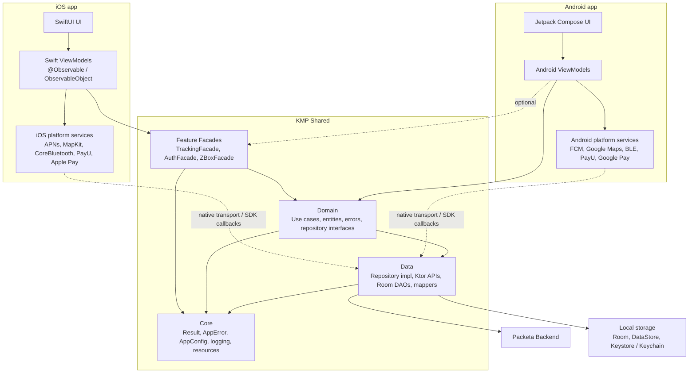
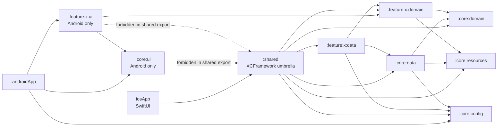
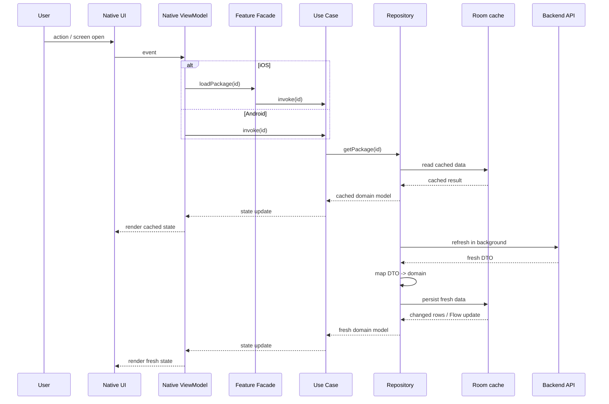
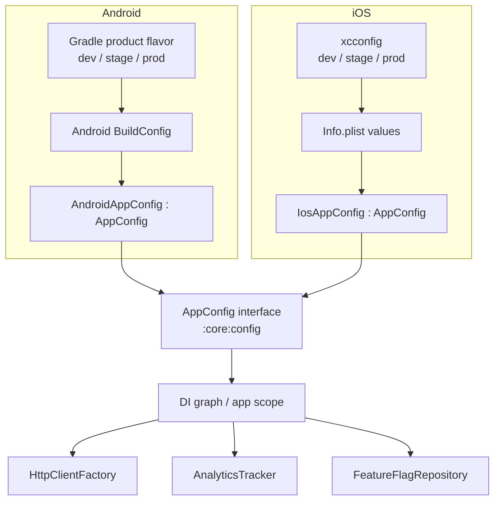
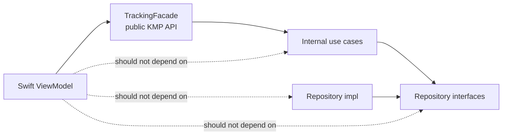
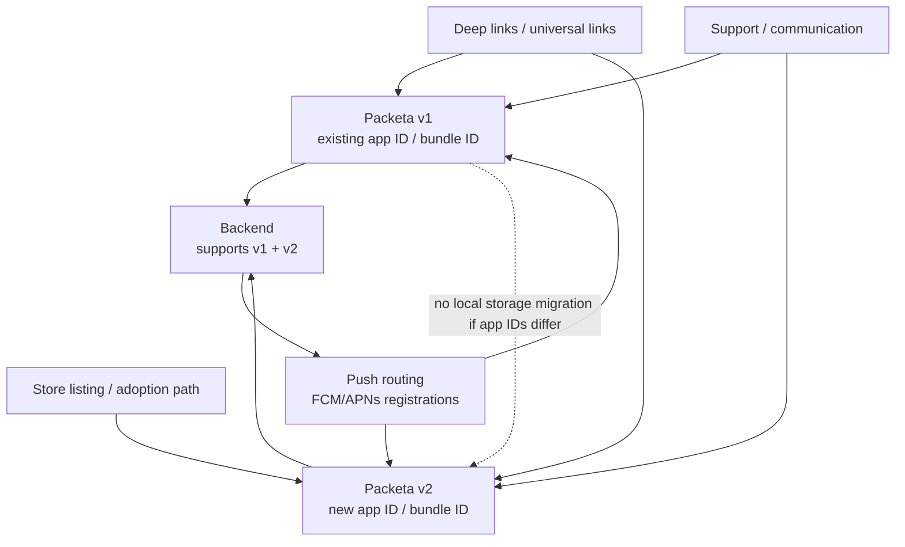
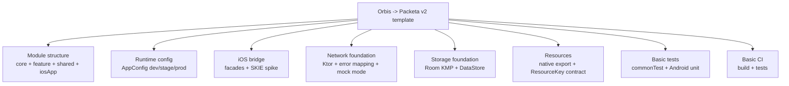
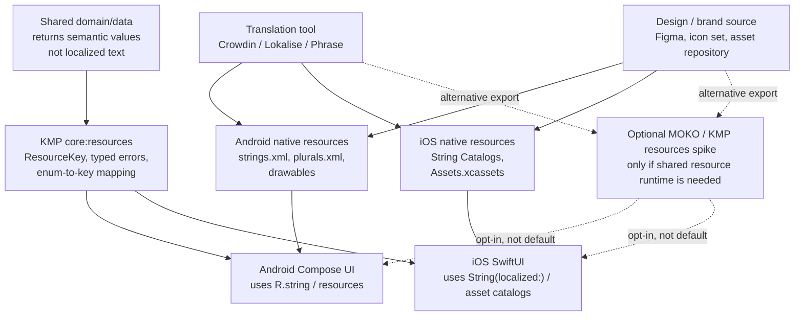

# Packeta v2.0 - Architecture Diagrams

> Status: draft (2026-04-15)
> Goal: visual map of how KMP shared code, native presentation layers, backend, config, resources, and v1 -> v2 transition fit together.

## 1. High-Level Architecture

### What This Shows

This diagram shows the main ownership boundary. Android and iOS own their UI, ViewModels, navigation, and platform SDK integrations. KMP owns the shared feature API, domain rules, data access, API mapping, caching, and common error/config contracts.

The iOS app calls shared code through feature facades. Android can call domain use cases directly, but it may also use the same facade pattern where that makes feature boundaries clearer. Platform services such as BLE, maps, push, and payments stay native because their APIs, permissions, lifecycle, and UX differ per platform.

### Key Takeaways

- UI and ViewModels are native.
- iOS calls shared code through feature facades.
- Android can call use cases directly; it may also use facades to align feature boundaries.
- Data/domain logic, API mapping, error mapping, and cache live in KMP.
- Platform SDK integrations stay native.

## 2. Module Dependency Graph

### What This Shows

This diagram describes compile-time module dependencies, not runtime data flow. The Android app depends on Android UI modules and the shared KMP modules it needs. The iOS app consumes only the `:shared` umbrella framework.

The important rule is that Android-only UI modules are not exported to iOS. `:core:ui` and `:feature:x:ui` are Compose-only modules. KMP domain/data modules can be part of the iOS framework; Android UI modules cannot.

### Dependency Rules

- `domain` must not depend on `data`.
- `data` implements repository interfaces from `domain`.
- `ui` modules are Android-only and must not be part of the iOS `:shared` export.
- `:shared` is the umbrella module for the iOS XCFramework.
- `:core:config` is a shared contract; values are supplied by the app module through runtime injection.

## 3. Runtime Data Flow

### What This Shows

This sequence shows a typical cache-first read flow. A user action reaches a native screen and native ViewModel. iOS goes through a feature facade before calling the shared use case. Android can call the use case directly.

The repository first reads cached data and returns it to the UI so the screen can render quickly. Then it refreshes from backend, maps the DTO to a domain model, persists it, and emits the updated state. This flow is useful for package lists, package detail, and other server-owned read models.

### Exceptions

Payments, Z-Box open, and auth do not follow this flow blindly. Those flows are online-only or have stricter backend/device confirmation rules.

## 4. Environment / Config Flow

### What This Shows

This diagram shows how environment-specific values enter shared KMP code. Android can use Gradle product flavors and `BuildConfig`. iOS can use `xcconfig` and `Info.plist`. Both platforms adapt those values into the same shared `AppConfig` interface.

Shared modules depend only on the `AppConfig` contract. They do not know whether the value came from Android Gradle, Xcode, CI, or local developer config.

### Why Runtime Config Injection

The Android-KMP library plugin is single-variant for shared libraries. Shared modules do not have product flavors. Environment values must not be hardcoded in shared code. The app module supplies them through `AppConfig`.

## 5. iOS Public API Boundary

### What This Shows

This diagram defines the public API boundary for iOS. Swift ViewModels should call a stable feature facade, for example `TrackingFacade`, instead of reaching into individual use cases, repository interfaces, or data implementations.

The facade is not a ViewModel. It is a Swift-facing API layer that hides Kotlin implementation details and keeps the exported API smaller, more stable, and easier to review.

### Rule

iOS depends on feature facades, not internal use cases or repository implementations.

## 6. v1 -> v2 Transition

### What This Shows

This diagram explains why v1 -> v2 is not a local migration problem if v2 uses a new app ID / bundle ID. The OS treats v2 as a separate app, so it cannot see v1 local database, preferences, or tokens.

The transition therefore needs product and backend coordination: store adoption path, fresh login, backend support for both app generations, push routing, deep-link routing, and support communication.

### Impact

- v2 is treated as a new app if app IDs differ.
- Local v1 database/preferences/tokens are not visible to v2.
- User needs fresh login.
- Transition needs backend, push, deep-link, store, and support strategy.

## 7. First Template Scope

### What This Shows

This diagram defines what the Orbis-based template should prove first. The template should establish the project structure, build wiring, runtime config, iOS bridge, networking foundation, storage foundation, resource contract, tests, and basic CI.

It keeps feature-specific topics out of the first scaffold. Payments, BLE, full release readiness, and the complete security program remain documented in ADRs, but they are outside the first onboarding/auth foundation.

### Build First

Build the project foundation before implementing product-heavy flows. Payments, BLE, and release readiness are important, but they are not required for the first onboarding/auth scaffold.

## 8. Resources / Localization Workflow

### What This Shows

This diagram shows the proposed default for strings, plurals, icons, and image assets. The source of truth for translations is a translation tool. The source of truth for visual assets is the design/brand asset source. Those sources export into platform-native resource formats.

KMP does not return final localized UI text by default. Shared code returns semantic values: typed errors, enums, or `ResourceKey` values. Android and iOS map those semantic values to their own native resources.

MOKO is shown as a dashed alternative path because it is not the default. It becomes relevant only if the team decides it needs a shared KMP resource runtime.

### Key Takeaways

- Strings are not manually duplicated in Android and iOS; the translation tool owns the source.
- Android still gets Android-native resources.
- iOS still gets iOS-native String Catalogs and asset catalogs.
- KMP owns semantic keys, not user-facing localized text.
- MOKO requires a spike because it changes resource ownership and iOS build integration.
